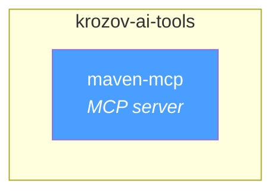
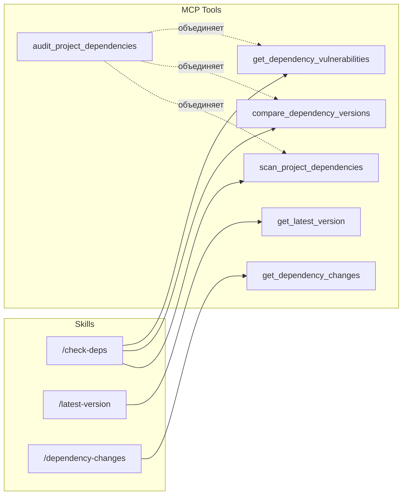

# krozov-ai-tools: Руководство по плагинам

Монорепозиторий Claude Code плагинов от krozov. Все плагины используют единую версионность — каждый релиз обновляет все плагины до одной версии.

Репозиторий: [github.com/kirich1409/krozov-ai-tools](https://github.com/kirich1409/krozov-ai-tools)

---

## Содержание

1. [Карта плагинов](#карта-плагинов)
2. [maven-mcp](#maven-mcp)
3. [Справочная таблица slash-команд](#справочная-таблица-slash-команд)
4. [Установка](#установка)

---

## Карта плагинов



| Плагин | Тип | Назначение |
|--------|-----|------------|
| maven-mcp | MCP server + skills + hook | Анализ Maven-зависимостей |

---

## maven-mcp

Maven dependency intelligence. MCP-сервер для запросов к Maven Central, Google Maven и custom-репозиториям. Распространяется как npm-пакет `@krozov/maven-central-mcp`.

### MCP-инструменты (9 штук)

| Инструмент | Описание |
|------------|----------|
| `get_latest_version` | Найти последнюю версию артефакта с учётом стабильности |
| `check_version_exists` | Проверить существование конкретной версии и классифицировать стабильность |
| `check_multiple_dependencies` | Массовый поиск последних версий для списка зависимостей |
| `compare_dependency_versions` | Сравнить текущие версии с последними, показать тип обновления (major/minor/patch) |
| `get_dependency_changes` | Показать изменения между двумя версиями зависимости (release notes, changelog) |
| `scan_project_dependencies` | Сканировать build-файлы проекта и извлечь все зависимости с версиями |
| `get_dependency_vulnerabilities` | Проверить зависимости на известные уязвимости (CVE) через OSV |
| `search_artifacts` | Поиск артефактов на Maven Central по ключевым словам |
| `audit_project_dependencies` | Полный аудит: сканирование + сравнение версий + проверка уязвимостей |

### Skills (3 штуки)

| Skill | Команда | Когда использовать |
|-------|---------|-------------------|
| latest-version | `/latest-version` | Нужно найти последнюю версию конкретной библиотеки |
| check-deps | `/check-deps` | Проверить все зависимости проекта на актуальность |
| dependency-changes | `/dependency-changes` | Узнать, что изменилось между версиями зависимости |

### Hook (1 штука)

| Event | Matcher | Действие |
|-------|---------|----------|
| PostToolUse | `Edit\|Write` | После редактирования build-файлов напоминает проверить зависимости |

### Поток данных: skill → tool



### Требования

- **Node.js 18+** — обязательно
- **GITHUB_TOKEN** — опционально, увеличивает лимит GitHub API с 60 до 5000 запросов/час (для `get_dependency_changes`)
- **jq** — опционально, для hook `post-edit-deps`

### Поддерживаемые build-системы

- Gradle (Groovy DSL: `build.gradle`, `settings.gradle`)
- Gradle (Kotlin DSL: `build.gradle.kts`, `settings.gradle.kts`)
- Maven (`pom.xml`)
- Version Catalogs (`gradle/libs.versions.toml`)


## Справочная таблица slash-команд

| Команда | Плагин | Описание |
|---------|--------|----------|
| `/latest-version` | maven-mcp | Найти последнюю версию Maven-артефакта |
| `/check-deps` | maven-mcp | Проверить все зависимости проекта на обновления |
| `/dependency-changes` | maven-mcp | Показать changelog между версиями зависимости |

---

## Установка

### Добавить marketplace

```
/plugin marketplace add kirich1409/krozov-ai-tools
```

### Отдельные плагины

```
/plugin install maven-mcp@krozov-ai-tools
```
