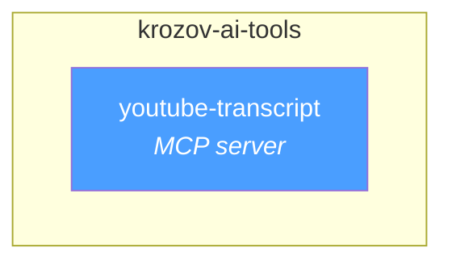

# krozov-ai-tools: Руководство по плагинам

Монорепозиторий Claude Code плагинов от krozov. В marketplace один плагин. Версии плагинов независимы.

Репозиторий: [github.com/kirich1409/krozov-ai-tools](https://github.com/kirich1409/krozov-ai-tools)

`maven-mcp` живёт в [kirich1409/maven-mcp](https://github.com/kirich1409/maven-mcp). Этот marketplace его не ставит. Инструменты, skills и установка — в README того репозитория.

---

## Содержание

1. [Карта плагинов](#карта-плагинов)
2. [youtube-transcript](#youtube-transcript)
3. [Установка](#установка)

---

## Карта плагинов


```mermaid
graph TB
    subgraph repo["krozov-ai-tools"]
        yt["youtube-transcript<br/><i>MCP server</i>"]
    end

    style yt fill:#4a9eff,color:#fff
```

| Плагин | Тип | Назначение |
|--------|-----|------------|
| youtube-transcript | MCP server | Субтитры YouTube |

---

## youtube-transcript

Забирает уже опубликованные субтитры YouTube (ручные или автоматические) через InnerTube и отдаёт их как текст, SRT или VTT. Распознавания речи и скачивания видео нет.

Python 3.9+, только стандартная библиотека. Полное описание: [`plugins/youtube-transcript/README.md`](../plugins/youtube-transcript/README.md).

| Инструмент | Описание |
|------------|----------|
| `list_transcript_tracks` | Список дорожек субтитров без загрузки текста |
| `get_transcript` | Текст субтитров (`text`, `srt` или `vtt`) с постраничной выдачей |

---

## Установка

### Добавить marketplace

```
/plugin marketplace add kirich1409/krozov-ai-tools
```

### Плагин из этого репозитория

```
/plugin install youtube-transcript@krozov-ai-tools
```

`maven-mcp` ставится из https://github.com/kirich1409/maven-mcp, не из этого marketplace.
