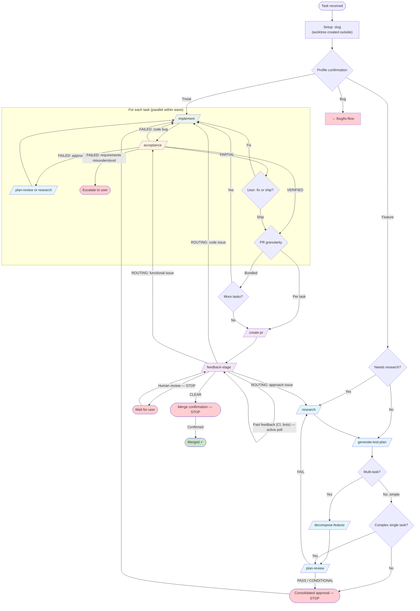

# Orchestrator Flows

Two thin orchestrators manage the full development cycle. Each routes tasks through
modular skills — no implementation logic, only state transitions.

For stage contracts and artifact formats, see [WORKFLOW.md](WORKFLOW.md).

---

## Feature Flow (`/feature-flow`)

### Stop points

| When | What happens |
|------|-------------|
| Profile confirmation | Ask user to confirm feature profile |
| Consolidated approval | Present research + test plan + implementation plan; wait for go-ahead |
| PARTIAL acceptance | User decides: fix now or ship as-is |
| Human PR review | Stop, report PR status, resume on user command |
| Requirements misunderstood | Escalate — cannot proceed without user clarification |
| Merge confirmation | Always ask before merging; no exceptions |
| Escalation | Scope explosion, 3× same failure, architectural decision needed |

### Backward transition limits

| From → To | Max | After limit |
|-----------|-----|-------------|
| PlanReview → Research | 2 | Escalate |
| Acceptance → Implement | 3 | Escalate |
| Acceptance → PlanReview / Research | 2 | Escalate |
| FeedbackStage → Implement | 3 | Escalate |
| FeedbackStage → Research | 2 | Escalate |
| FeedbackStage → Acceptance | 2 | Escalate |

---

## Bugfix Flow (`/bugfix-flow`)

```mermaid
flowchart TD
    start([Bug reported]) --> setup["Setup: slug\n(worktree created outside)"]
    setup --> confirm{Profile confirmation}
    confirm -->|Feature| redirect_feat[→ /feature-flow]
    confirm -->|Trivial fix| impl
    confirm -->|Bug| debug

    debug[/debug/] --> debug_result{Status?}
    debug_result -->|Diagnosed, simple| impl
    debug_result -->|Diagnosed, complex| plan[Plan + /plan-review/]
    debug_result -->|Not reproducible| stop_nr([Stop: need more info])
    debug_result -->|Escalated| stop_esc([Stop: user decision])

    plan -->|PASS| impl
    plan -->|FAIL| debug

    impl[/implement/] --> acceptance[/acceptance/]

    acceptance -->|"VERIFIED (bug gone)"| create_pr
    acceptance -->|"FAILED: code bug"| impl
    acceptance -->|"FAILED: code bug ×2"| debug
    acceptance -->|"FAILED: approach / design"| plan
    acceptance -->|PARTIAL| user_decision{User: fix or ship?}

    user_decision -->|Fix| impl
    user_decision -->|Ship| create_pr

    create_pr[/create-pr/] --> feedback[/feedback-stage/]
    feedback -->|"Fast feedback (CI, bots) — active poll"| feedback
    feedback -->|"Human review — STOP"| wait_review([Wait for user])
    wait_review --> feedback
    feedback -->|"ROUTING: code issue"| impl
    feedback -->|"ROUTING: approach issue"| debug
    feedback -->|"ROUTING: functional issue"| acceptance
    feedback -->|CLEAR| merge_confirm([Merge confirmation — STOP])
    merge_confirm -->|Confirmed| merge([Merged ✓])

    style debug fill:#e1f5fe
    style plan fill:#e1f5fe
    style impl fill:#e8f5e9
    style acceptance fill:#fff3e0
    style create_pr fill:#f3e5f5
    style feedback fill:#f3e5f5
    style wait_review fill:#ffcdd2
    style stop_nr fill:#ffcdd2
    style stop_esc fill:#ffcdd2
    style merge_confirm fill:#ffcdd2
    style merge fill:#c8e6c9
    style redirect_feat fill:#ffcdd2
```

### Stop points

| When | What happens |
|------|-------------|
| Profile confirmation | Ask user to confirm bug profile |
| Bug not reproducible | Stop, ask for more info |
| Debug escalation | Architectural issue or needs user decision |
| PARTIAL acceptance | User decides: fix now or ship as-is |
| Human PR review | Stop, report PR status, resume on user command |
| Merge confirmation | Always ask before merging; no exceptions |

### Backward transition limits

| From → To | Max | After limit |
|-----------|-----|-------------|
| Acceptance → Implement | 3 | Escalate |
| Acceptance → Debug | 2 | Escalate |
| FeedbackStage → Implement | 3 | Escalate |
| FeedbackStage → Debug | 2 | Escalate |
| FeedbackStage → Acceptance | 2 | Escalate |

---

## Stage legend

| Color | Meaning |
|-------|---------|
| 🔵 Blue | Research / diagnosis / planning |
| 🟢 Green | Implementation |
| 🟠 Orange | Verification |
| 🟣 Purple | PR / feedback |
| 🔴 Red | Stop / wait for user |
| ✅ Green border | Done |
