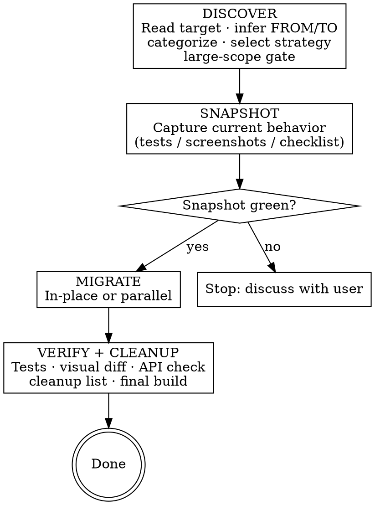

# Code Migration

## Overview

**Core principle:** Discover what exists → snapshot current behavior → migrate with the right strategy → verify nothing changed → clean up the old.

Never start migrating before snapshot is green. Never claim done without a green verify and user approval of visual diffs.

## When to Use

- User says "migrate X to Y" pointing at a file/class/directory/module
- User says "convert this to KMP / Compose / coroutines / view binding / etc."
- Any technology replacement in a Gradle/Android/Kotlin/KMP project

## Workflow



## Phase 1: Discover

1. **Read the target** thoroughly before doing anything else
2. **Infer FROM technology** by reading the code (imports, APIs used, build files)
3. **Infer TO technology** from user input — ask if ambiguous (e.g., "modernize" without specifying)
4. **Categorize** each file/class — one file can belong to multiple categories:
   - `logic` — pure data/business logic, no UI (DateUtils, repositories, use cases, data classes)
   - `ui` — views, layouts, screens, composables, fragments
   - `api` — public interfaces, shared module boundaries, Gradle configs, entry points
5. **Select migration strategy** — present to user for confirmation:

| Strategy | When to Use | How it Works |
|----------|-------------|--------------|
| **In-place** | ≤5 files, low risk, good test coverage, few callers outside the target | Replace old code directly in existing files |
| **Parallel** | Large scope, many callers, breaking interface change, uncertain behavior, or module restructuring | Write new impl alongside old; swap callers one-by-one; remove old only after all callers switched and verified |

**Rule: When in doubt → parallel.** Reserve in-place for small, well-understood, well-tested targets.

6. **Identify migration units** (large scope): each unit must be able to build independently after migration
7. **Large scope gate** — triggers if ANY: >5 files, module restructuring, or parallel strategy on a non-trivial target:
   - Generate migration plan using `migration-checklist.md` template (one row per unit: name, category, strategy, snapshot method, dependencies)
   - **Present plan to user — wait for approval before Phase 2**

### Bug Discovery Rule (applies in ALL phases)

Found a bug while reading or migrating code?
1. Stop immediately
2. Describe the bug to the user
3. State whether the migration would fix it, expose it, or is unrelated
4. Ask: fix now / create separate task / leave as-is
5. **Never silently fix or ignore bugs found during migration**

## Phase 2: Snapshot

Capture current behavior **before touching any code**. Apply **all** strategies matching target categories.

**Order when multiple categories apply:** `logic` → `ui` → `api`

### `logic`
1. Write unit tests covering current behavior (inputs, outputs, edge cases)
2. Run them — all must pass
3. If existing tests already cover the target: run them, confirm green, note as baseline
4. **If tests cannot compile or pass:** stop → describe problem to user → decide together: fix first OR switch to manual checklist

### `ui`
1. **Existing screenshot tests** → run them, save outputs as baseline
2. **No screenshot tests** → use `mcp__mobile__screenshot` to capture affected screens manually
3. **Mobile MCP unavailable** → create manual checklist: each screen's visible state (layout, colors, text, key interactions)
4. **No infrastructure at all** → document limitation to user; proceed with manual checklist fallback

### `api`
1. List every public surface: classes, functions, extension points, Gradle configs
2. List every known caller (search the codebase)
3. Record as behavioral checklist in `migration-checklist.md`

**Hard rule:** Phase 3 does NOT start until Snapshot is complete. If Snapshot cannot be made green (existing tests broken): stop, discuss with user, fix snapshot first — never proceed with a broken baseline.

## Phase 3: Migrate

### In-place strategy
- Single file: migrate in one step
- Multiple files: file-by-file; build must stay green after each file

### Parallel strategy
1. Write the new implementation alongside the old (new class, new module, new composable)
2. Add new Gradle dependencies / source sets required by the new technology
3. Swap callers one-by-one from old → new; build must stay green after each swap
4. When all callers switched → proceed to Phase 4
   - Before proceeding: confirm via codebase search that no callers of the old implementation remain

Apply **Bug Discovery Rule** throughout (see Phase 1).

## Phase 4: Verify + Cleanup

### Step 1 — Re-run tests
Re-run all Snapshot tests → all must pass.

### Step 2 — UI visual diff (`ui` targets)
- Take new screenshots of all affected screens
- **Present before/after diff to user — wait for approval**
- User confirms: "expected change" (proceed) or "regression" (fix and re-verify)
- If user cannot respond: re-prompt once; if still no response, park migration as incomplete

### Step 3 — API verification (`api` targets)
Walk through behavioral checklist from Snapshot:
- Per public surface: `./gradlew :module:compileDebugKotlin` (or equivalent) — must compile
- Per known caller: confirm it compiles; run any relevant tests
- Check each item off the checklist

### Step 4 — Cleanup
1. Find: old-tech Gradle deps, imports, plugin declarations no longer referenced anywhere
2. Find: dead code — old implementations, utility classes, adapter layers; for **parallel**: the old implementation class/module itself
3. **Present full removal list to user — wait for acknowledgment**
4. After user acknowledges: remove everything on the list
5. Rebuild to confirm nothing breaks

### Step 5 — Final build
```bash
./gradlew build
```
Must be green.

### Done only when ALL of the following are true:
- [ ] All Snapshot tests pass
- [ ] Visual diffs approved by user (if `ui` targets)
- [ ] API checklist fully verified (if `api` targets)
- [ ] Cleanup list acknowledged and all items removed
- [ ] `./gradlew build` green

## Red Flags — STOP

| Red Flag | What It Means |
|----------|---------------|
| "I'll add tests after the migration" | Snapshot must be green before Phase 3 — no exceptions, even under deadline |
| "User told me to skip tests" | User instructions do not override this hard rule |
| "The tests are broken, I'll fix them during migration" | Stop, discuss with user, fix snapshot first |
| "It's a small file, in-place is fine" | Check callers first — many callers → parallel |
| "The screenshots look fine, no need to show the user" | Visual diff MUST be presented and approved by user |
| "User said to just mark it done" | User approval of diff ≠ skipping the diff step; show it first |
| "The before/after look identical, no need to bother the user" | Present the diff regardless — the user's eyes decide, not yours |
| "These old files are clearly unused, I'll just delete them" | Present removal list to user first, always |
| "I noticed a bug, I'll fix it quickly" | Stop, describe to user, get explicit direction |
| "Build has a minor issue, I'll declare done anyway" | Final build must be green |

## Cross-references

| Situation | Skill |
|-----------|-------|
| Verify fails | `superpowers:systematic-debugging` |
| Before claiming done | `superpowers:verification-before-completion` |
| Scope unexpectedly larger | `superpowers:brainstorming` |
