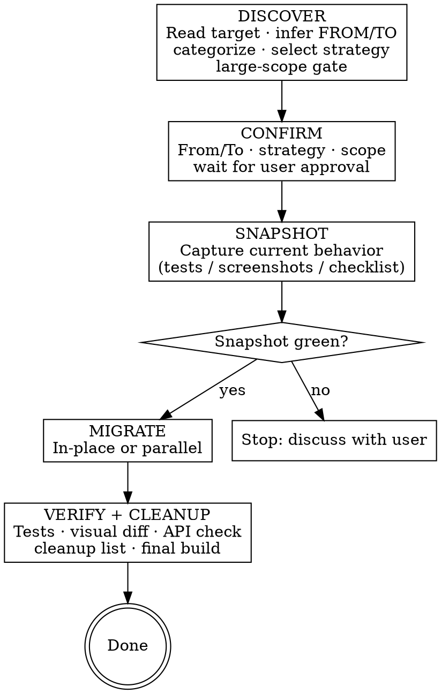

# Code Migration

## Overview

**Core principle:** Discover what exists → confirm FROM/TO with user → snapshot current behavior → migrate with the right strategy → verify nothing changed → clean up the old.

Never start migrating before snapshot is green. Never claim done without a green verify and user approval of visual diffs.

## Workflow



## PR Strategy

**Never do a large migration in a single MR.** One huge PR is hard to review, hard to roll back, and hides regressions until it's too late. Break migrations into small, independently mergeable PRs — each one green on its own.

Natural PR boundaries for most migrations:

| PR | Contents | Why separate |
|----|----------|-------------|
| **Preparation** | Module isolation, `migration-checklist.md`, `behavior-spec.md` | Sets up the plan; no behavior change; easy to review |
| **Snapshot** | Characterization tests only — no production code changes | Reviewers can verify tests are green and match existing behavior before anything moves |
| **Migration batch(es)** | Actual code changes — split by module, layer, or file group (e.g., data layer first, then domain, then UI) | Each batch is independently rollbackable; CI catches regressions at each step |
| **Bridge cleanup** | Remove `*Compat.kt` / `*Bridge.kt`, old implementation, old Gradle deps | Clearly separated from migration logic; easy to verify nothing is still referencing the old code |

For each migration PR: all Snapshot tests must be green before it merges. Do not merge a batch that breaks the baseline.

When proposing a migration plan, include the PR breakdown explicitly — this is part of the migration strategy, not an afterthought.

## Phase 1: Discover

1. **Read the target** thoroughly before doing anything else
2. **Infer FROM technology** by reading the code (imports, APIs used, build files)
3. **Infer TO technology** from user input — ask if ambiguous (e.g., "modernize" without specifying)
4. **Categorize** each file/class — one file can belong to multiple categories:
   - `logic` — pure data/business logic, no UI (DateUtils, repositories, use cases, data classes)
   - `ui` — views, layouts, screens, composables, fragments
   - `api` — public interfaces, shared module boundaries, Gradle configs, entry points
5. **Analyze codebase impact** — gather the facts that drive the proposal:
   - **Callers:** how many files/modules depend on the target? (search imports and usages)
   - **Hidden consumers:** Gradle tasks referencing the target, Proguard/R8 keep rules, event subscribers, data converters, CI scripts — these break silently and are often missed
   - **Module boundary:** is the target already in its own Gradle module, or mixed into a larger one?
   - **Test coverage:** are there existing tests? how much behavior is already captured?
   - **API stability:** does the public interface change, or only the internals?
   - **Build speed:** is the full project build slow? (isolation pays off more when it is)
   - **Dependent library compatibility** (all migrations that change a foundational technology): when you migrate from one framework or library to another, existing dependencies often include adapters, extensions, or artifacts that are specific to the old technology. Read `build.gradle.kts` for the affected modules and check for these. Common examples:
     - RxJava → coroutines: `room-rxjava2`, `retrofit2:adapter-rxjava2`, `rxandroid` — these need to be swapped for `room-ktx`, `retrofit2` (built-in suspend support), etc.
     - View/XML → Compose: any View-only widget library (custom carousels, PDF viewers, chart libraries) that has no Compose equivalent or requires interop wrappers
     - Retrofit → Ktor: all Retrofit converters, interceptor adapters, and mock server integrations
     - Java → Kotlin: Java-only annotation processors that don't support `kapt` or KSP

     For each affected dependency: categorize as **replace** (swap to a different artifact), **update** (newer version of same artifact adds support), **remove** (no longer needed after migration), or **compatible** (technology-agnostic, no action needed). Use `maven-mcp` tools if available to check latest artifact names and versions.

     Present the matrix to the user before Phase 2. Each "replace" or breaking update is a nested decision that affects the migration scope — the user must decide whether to handle it as a preparation PR, fold it into scope, or defer it. Do not absorb these decisions silently.

6. **Propose 1–3 strategy options** — based on what you found. Be opinionated: one option should be clearly recommended, and any strategy that doesn't fit this codebase should be dismissed with a specific reason, not silently omitted or presented as a peer alternative.

   Format each option like this:

   > **Option A — [Strategy name]** ⭐ recommended
   > Preparation: [what to do before migrating — e.g., extract module, add tests, introduce interface — or "none"]
   > Migration: [how the actual migration proceeds]
   > PRs: [how the work splits into PRs — e.g., "PR 1: module isolation + tests, PR 2: data layer, PR 3: UI layer, PR 4: cleanup"]
   > Effort: low / medium / high
   > Risk: low / medium / high
   > Why: [1–2 sentences tied to what you found in step 5]

   Non-recommended options may still be offered if they are genuinely viable (different trade-offs, not wrong). But strategies that don't fit should be explicitly dismissed — name them and explain why based on what you found:

   > **Not offered:** Big Bang — 6 callers across 4 modules with no tests means a regression has no safety net and is expensive to debug. In-place — breaking interface change means all 6 ViewModels must be updated simultaneously, too broad for a single step.

   Dismissing a strategy clearly is more useful than listing it as an option. Users often default to what sounds familiar; if Big Bang or in-place is wrong for this codebase, say so directly rather than presenting it as a choice.

   **Strategy reference:**

   | Strategy | Core mechanism | Fits when |
   |----------|---------------|-----------|
   | **In-place** | Replace directly in existing files; build stays green after each file | ≤5 files, few external callers, good test coverage, internals-only change |
   | **Parallel (Expand-Contract)** | **Expand:** add new impl alongside old. **Migrate:** swap callers one-by-one (each step independently rollbackable). **Contract:** delete old when all callers switched. Layer-by-layer for large scope (data → domain → UI) | Many callers, breaking interface change, uncertain behavior, large scope |
   | **Branch by Abstraction** | Introduce interface → implement new behind it → swap DI binding → delete old. Callers never change | Public API must stay stable; new technology fits behind the same interface |
   | **Big Bang** | Full rewrite on a branch; switch at merge. **Requires:** explicit rollback plan agreed with user before starting — what condition triggers rollback, who decides, and is the rollback path tested? | Coupling makes incremental impractical. Last resort — flag the risk explicitly |
   | **Feature-flagged Parallel** | New impl behind a feature flag; old path stays live. Flag enables gradual rollout or instant rollback without redeployment | Large UI migrations (e.g., Compose rollout screen-by-screen); risky behavioral changes where production validation is needed before full switch |

   **When to include module isolation as preparation:**
   Propose extracting to a dedicated Gradle module when it reduces risk or effort more than it adds:
   - Target is mixed into a large module and the migration changes its public API — isolation limits blast radius to dependents of that module, and `./gradlew :new-module:assemble` gives fast feedback
   - Build is slow and targeted module builds would meaningfully speed up iteration
   - Skip when the target is already isolated, or when it's a small in-place change with few callers

   Isolation sequence (when included as preparation): extract → `./gradlew :new-module:assemble` green → migrate inside the module.

7. **After user chooses** — if the chosen option involves >5 files or module restructuring, generate a `migration-checklist.md`:

   ```markdown
   | Unit | Category | Strategy | Snapshot method | Depends on |
   |------|----------|----------|-----------------|------------|
   | UserRepository | logic | Parallel | characterization tests | — |
   | UserViewModel | logic | In-place | characterization tests | UserRepository |
   | FeedFragment | ui | Feature-flagged | screenshot baseline | — |
   ```

   **Present plan to user — wait for approval before Phase 2**

### Bug Discovery Rule (applies in ALL phases)

Found a bug while reading or migrating code?
1. Stop immediately
2. Describe the bug to the user
3. State whether the migration would fix it, expose it, or is unrelated
4. Ask: fix now / create separate task / leave as-is
5. **Never silently fix or ignore bugs found during migration**

## Phase 2: Snapshot

Capture current behavior **before touching any code**. Apply **all** strategies matching target categories.

**Order when multiple categories apply:** `logic` → `ui` → `api`

### Behavior Specification (all targets)

Before writing tests or taking screenshots, produce a `behavior-spec.md` for the target. This is the source of truth for what the migration must preserve — readable by the user, checkable in Phase 4, and independent of any particular test framework.

```markdown
# Behavior Specification: [TargetName]
FROM: [technology] → TO: [technology]

## Public Interface
| Method / Property | Inputs | Output / Side Effect | Notes |
|---|---|---|---|
| `methodName(x)` | type, constraints | return type + value | e.g. "returns null for id ≤ 0" |

## Normal Behaviors
- [description of each significant behavior]

## Edge Cases
- [inputs at boundaries, empty collections, zero, max values]

## Quirks (preserve exactly unless user decides otherwise)
- [unexpected nullability, swallowed exceptions, hardcoded values, implicit assumptions]
- [parsing/formatting library defaults that differ from intuition — e.g., `SimpleDateFormat.isLenient() == true` means invalid dates like month 13 silently overflow rather than throwing; `DateTimeFormatter` is strict by default — these semantics differ and callers may rely on the lenient behavior]
- [thread-safety assumptions — e.g., `SimpleDateFormat` is not thread-safe; its Kotlin equivalent is; callers that share a single instance across threads have hidden race conditions that must be preserved or explicitly fixed]
- [timezone implicit dependencies — methods that use `TimeZone.getDefault()` silently; behavior differs across JVM configurations]

## Out of Scope
- [behaviors that will intentionally change after migration]
```

**Present the completed spec to the user and wait for explicit confirmation before Phase 3.** Do not proceed to Phase 3 (migration) until the user has acknowledged the spec. Use this prompt:

> "Here is the behavior spec for [TargetName]. Please review it before I begin the migration:
> - Are the public interface signatures correct?
> - Are there any quirks you want to mark as bugs to fix (rather than preserve)?
> - Are there behaviors that should intentionally change after migration?
>
> Reply 'confirmed' to proceed, or point out anything to correct."

They may correct misunderstandings, mark quirks as bugs to fix, or explicitly list what should change. This confirmation is the shared contract for the migration.

### `logic`
Write **characterization tests** — tests that capture what the code *actually does*, not what it ideally should do. This distinction matters: legacy code often encodes years of production bug fixes and edge-case handling that aren't documented anywhere. The goal is a behavioral safety net, not a correctness audit.

1. Read the code carefully and write tests that pin down actual inputs/outputs, including edge cases, nullability behavior, error paths, and any quirks you notice
2. If existing tests already cover the target: run them, confirm green — but also check if they're comprehensive enough to catch behavioral regressions in the parts you'll change
3. **Async/callback-heavy code** (RxJava, coroutines, listeners, callbacks): write synchronous characterization tests that still exercise the async paths — use `blockingGet()` / `TestObserver` for RxJava, `runBlocking { }` for coroutines, or a `CountDownLatch`/`CompletableFuture` for callbacks. Don't skip async behaviors — they're often the most important to capture, and they expose timing/threading assumptions that the migration must preserve.
4. Run all tests — all must pass before proceeding
5. Note any surprising behaviors you discover (e.g., silent null returns, unexpected exception swallowing) — these are not bugs to fix now, but they must be preserved through the migration unless the user explicitly decides otherwise
6. **If tests cannot compile or pass:** stop → describe problem to user → decide together: fix first OR switch to manual checklist

### `ui`
1. **Existing screenshot tests** → run them, save outputs as baseline
2. **No screenshot tests** → use `mcp__mobile__screenshot` to capture affected screens manually
3. **Mobile MCP unavailable** → create manual checklist: each screen's visible state (layout, colors, text, key interactions)
4. **No infrastructure at all** → document limitation to user; proceed with manual checklist fallback

### `api`
1. List every public surface: classes, functions, extension points, Gradle configs
2. List every known caller (search the codebase)
3. Record as behavioral checklist in `migration-checklist.md`

**Hard rule:** Phase 3 does NOT start until Snapshot is complete. If Snapshot cannot be made green (existing tests broken): stop, discuss with user, fix snapshot first — never proceed with a broken baseline.

## Phase 3: Migrate

### In-place strategy
- Single file: migrate in one step
- Multiple files: file-by-file; build must stay green after each file
- **Commit cadence:** commit after each file is migrated and tests are green

### Extension function bridge (Parallel variant)

When the migration involves an API shape change (e.g., RxJava → coroutines), extension functions can serve as a temporary bridge layer — keeping both old and new callers happy simultaneously without duplicating the implementation. Two directions:

**Direction A — Implementation-first (rewrite core, keep old surface for callers)**
1. Rewrite the implementation to the new technology (e.g., `suspend fun`/`Flow`)
2. Add a `*Compat.kt` file with extension functions that re-expose the old API style:
   ```kotlin
   // UserRepositoryCompat.kt — temporary bridge, deleted after migration
   fun UserRepository.getUserRx(id: String): Single<User> =
       rxSingle { getUser(id) }  // wraps suspend fun in RxJava
   ```
3. Callers compile unchanged. Migrate them one-by-one from `getUserRx()` → `getUser()` (suspend)
4. When all callers switched, delete `*Compat.kt` and remove RxJava dependency

**Direction B — Caller-first (callers adopt new style early, implementation migrates later)**
1. Keep the original implementation unchanged (RxJava)
2. Add extension functions that expose a coroutines surface over the existing RxJava API:
   ```kotlin
   // UserRepositoryExt.kt — temporary bridge, deleted after rewrite
   suspend fun UserRepository.getUserSuspend(id: String): User =
       getUser(id).await()  // wraps RxJava Single in coroutine
   ```
3. Migrate callers one-by-one from `getUser()` (RxJava) → `getUserSuspend()` (coroutine)
4. Once all callers use the suspend form, rewrite the implementation to native `suspend fun`
5. Rename `getUserSuspend` → `getUser`, delete extension file, remove RxJava dependency

**Choosing a direction:**
- Use **A** when the implementation is straightforward to rewrite and you want callers to migrate gradually afterward
- Use **B** when callers are numerous or spread across teams and you want to migrate them independently of the implementation rewrite — callers can move at their own pace without waiting for the implementation
- Both are temporary — the extension file is scaffolding, not permanent code. Name it clearly (`*Compat.kt`, `*Ext.kt`, or `*Bridge.kt`) and add a comment marking it for deletion

### Parallel strategy
1. **Place the new implementation** alongside the old:
   - Same package: use a `New` or `V2` suffix (e.g., `UserRepositoryImpl` → `UserRepositoryImplNew`) until callers are switched, then rename
   - New module: use a `new` or `next` suffix on the module name (`:feature-auth` → `:feature-auth-new`)
2. Add new Gradle dependencies required by the new technology
3. **Verify both old and new compile together** before touching callers:
   ```bash
   ./gradlew compileDebugKotlin          # Android module
   # or simply: ./gradlew :module:assemble
   ```
4. **Mark the old implementation as deprecated** before touching callers — this turns the IDE into a migration guide:
   ```kotlin
   @Deprecated(
       message = "Migrating to [NewTechnology]. Use NewImpl instead.",
       replaceWith = ReplaceWith("NewImpl(param)", "com.example.NewImpl"),
       level = DeprecationLevel.WARNING
   )
   fun oldFunction(param: String) = NewImpl(param)
   ```
   With `ReplaceWith` set, IntelliJ / Android Studio shows a **"Replace with..."** quick fix at every call site. To migrate all callers at once: **Analyze → Run Inspection by Name → "Usage of API marked for removal"** (or the Deprecated API usage inspection) → Apply fix to all. This is faster and safer than manual find-and-replace because the IDE resolves imports and handles overloads correctly.

   Use `DeprecationLevel.WARNING` while migrating (callers still compile), switch to `DeprecationLevel.ERROR` once you want to enforce the cutover, then delete after all callers are switched.

5. Swap callers one-by-one from old → new; build must stay green after each swap
6. **Commit cadence:** commit after new implementation compiles; commit again after each major batch of caller swaps
7. When all callers switched → proceed to Phase 4
   - Before proceeding: confirm via codebase search that no callers of the old implementation remain

### Branch by Abstraction strategy
Use when callers must not change — e.g., a heavily-used service class that many layers depend on. The key idea: introduce an interface that both old and new implementations satisfy, so the swap happens at the DI binding level without touching callers.

1. **Introduce an interface** that captures the current public API:
   ```kotlin
   interface AnalyticsTracker {
       fun track(event: String, properties: Map<String, Any> = emptyMap())
   }
   ```
2. **Make the old implementation implement it** — minimal change, callers still compile:
   ```kotlin
   class LegacyAnalyticsTracker : AnalyticsTracker { ... }
   ```
3. **Write the new implementation** behind the same interface:
   ```kotlin
   class NewAnalyticsTracker : AnalyticsTracker { ... }
   ```
4. **Swap the DI binding** from old to new (e.g., in a Hilt module or manual factory):
   ```kotlin
   @Provides fun provideTracker(): AnalyticsTracker = NewAnalyticsTracker()
   ```
5. **Delete the old implementation** once the new one is stable
6. Callers never touch the interface — they see no change

### Feature-flagged Parallel strategy
Use for large UI migrations (e.g., Compose rollout screen-by-screen) or any migration where production validation before full cutover matters.

1. **Add a feature flag** that selects old vs new path at runtime
2. **Build the new implementation** behind the flag — old path stays live:
   ```kotlin
   if (featureFlags.isEnabled("compose_feed")) {
       FeedScreenCompose()
   } else {
       FeedFragment()  // old path, untouched
   }
   ```
3. **Migrate screens/modules one at a time** — each gets its own flag or shares one per feature area
4. **Enable in production gradually** (internal → beta → full rollout) to catch regressions before they affect everyone
5. **Remove the flag and old path** once the new implementation is stable at 100% rollout
6. Flag the feature flag itself for cleanup — don't leave dead flag checks in the codebase

Apply **Bug Discovery Rule** throughout (see Phase 1).

## Phase 4: Verify + Cleanup

### Step 1 — Re-run tests
Re-run all Snapshot tests → all must pass.

**If tests fail after migration (regression):**
1. Do NOT proceed to Steps 2–6
2. Identify which test failed and why — this is a regression, not a pre-existing issue
3. Diagnose systematically:
   - Read the failing test — what behavior does it assert?
   - Read the new code that replaced the old — what did you change that affects this behavior?
   - Compare old vs new: did the semantics change (nullability, exception handling, edge cases, ordering)?
   - If not obvious: temporarily revert the single file and re-run to confirm the test was green before — then narrow down which change broke it
4. Fix the regression in the migrated code (never by weakening or deleting the test)
5. Re-run until all pass before continuing

### Step 2 — UI visual diff (`ui` targets)
- Take new screenshots of all affected screens
- **Present before/after diff to user — wait for approval**
- User confirms: "expected change" (proceed) or "regression" (fix and re-verify)
- If user cannot respond: re-prompt once; if still no response, park migration as incomplete

### Step 3 — Behavior spec review (all targets)
Walk through `behavior-spec.md` line by line against the new implementation:
- Every row in **Public Interface**: does the new code have the same signature or a documented intentional change?
- Every item in **Normal Behaviors** and **Edge Cases**: is it covered by a passing test, or manually verified?
- Every item in **Quirks**: is it preserved — or, if the user marked it for removal, confirm it's gone?
- Every item in **Out of Scope**: confirm the change is present and correct
- **Present the completed review to the user** — they confirm: "all behaviors accounted for" or point to gaps

### Step 4 — API compilation check (`api` targets)
- Per public surface: run the appropriate compile task for the module type — must compile
- Per known caller: confirm it compiles; run any relevant tests

### Step 5 — Cleanup
1. Find: old-tech Gradle deps, imports, plugin declarations no longer referenced anywhere — include any library adapters/artifacts identified in the Phase 1 dependency compatibility audit that are now obsolete
2. Find: dead code — old implementations, utility classes, adapter layers; for **parallel**: the old implementation class/module itself
3. **Present full removal list to user — wait for acknowledgment**
4. After user acknowledges: remove everything on the list
5. Rebuild to confirm nothing breaks

### Step 6 — Final build
```bash
./gradlew build
```
Must be green.

### Done only when ALL of the following are true:
- [ ] All Snapshot tests pass
- [ ] Visual diffs approved by user (if `ui` targets)
- [ ] Behavior spec reviewed line-by-line — user confirms all behaviors accounted for
- [ ] API compilation check passed (if `api` targets)
- [ ] Cleanup list acknowledged and all items removed
- [ ] `./gradlew build` green

## Red Flags — STOP

| Red Flag | What It Means |
|----------|---------------|
| "I'll add tests after the migration" | Snapshot must be green before Phase 3 — no exceptions, even under deadline |
| "User told me to skip tests" | User instructions do not override this hard rule |
| "The tests are broken, I'll fix them during migration" | Stop, discuss with user, fix snapshot first |
| "It's a small file, in-place is fine" | Check callers first — many callers → parallel |
| "The screenshots look fine, no need to show the user" | Visual diff MUST be presented and approved by user |
| "User said to just mark it done" | User approval of diff ≠ skipping the diff step; show it first |
| "The before/after look identical, no need to bother the user" | Present the diff regardless — the user's eyes decide, not yours |
| "These old files are clearly unused, I'll just delete them" | Present removal list to user first, always |
| "I noticed a bug, I'll fix it quickly" | Stop, describe to user, get explicit direction |
| "Build has a minor issue, I'll declare done anyway" | Final build must be green |
| "I'm confident I inferred FROM/TO correctly, no need to confirm" | Confirm anyway — inference from vague instructions is cheap to verify and expensive to redo |
| "Tests failed but it's probably a flaky test" | Treat all post-migration test failures as regressions until proven otherwise |

## When Things Go Wrong

**Verify fails (tests don't pass after migration):**
Use `superpowers:systematic-debugging` if available. Otherwise: read the failing test, compare old vs new code, revert a single file to confirm it was green before, then narrow down what broke it. Fix in the migrated code — never weaken the test.

**Before claiming done:**
Use `superpowers:verification-before-completion` if available. Otherwise: run through the "Done only when ALL of the following are true" checklist above line by line. Run the actual commands, don't assume they'll pass.

**Scope unexpectedly larger than expected:**
Stop. Describe the new scope to the user with a revised file count and risk assessment. Agree on a new strategy before continuing — do not silently expand the migration.

**Large migration needing a structured plan:**
Use `superpowers:writing-plans` if available. Otherwise: write a `migration-checklist.md` (see Phase 1, step 7 for the format) and share it with the user for approval before starting Phase 2.
