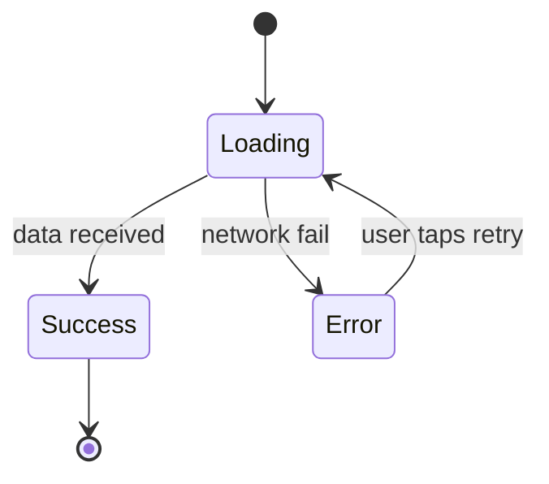

# Spec Template

Full template for `docs/spec/<slug>.md`. Section order is fixed — a reimplementer scans
specs in the same order for comparable features, so consistency across specs matters.

Sections that are genuinely not applicable for a given feature are kept as `N/A —
<one-line reason>`. Never delete a section; an empty section reads as oversight.

## Reading order

The spec is organised in four parts so that different readers can stop where they have
what they need:

- **Part A (§§1-7) — Product behavior.** What the feature does for the user. A PM /
  designer can read this and stop — they have the full product-facing picture.
- **Part B (§§8-9) — Product decisions & risks.** Open questions (unresolved intent)
  and known defects (bugs not to reproduce). Also product-facing — these are the
  decisions the team still owes the feature.
- **Part C (§§10-12) — Technical integration.** How the feature connects to the rest
  of the system: endpoints, storage, platform, collaborators, load-bearing tech. A
  dev-reimplementer reads this as the bridge between product intent and engineering
  choices.
- **Part D (§13) — Appendix.** Code map — `path:line` pointers for those who are
  actually modifying the current code. Safe to skip for anyone reimplementing on a
  different stack.

**Language rules for the body (Sections 1–8, 10–11):**

- Zero code identifiers. No class names, method names, type names, sealed-class cases,
  enum values, field names, file paths, reactive-primitive names, async-primitive
  names, or framework idioms. See `behavior-translation.md` for recipes.
- Keep technology references only when load-bearing (§12 only) — see
  `tech-abstraction.md`.
- Preserve verbatim: user-visible copy (quoted), exact numbers, URL patterns, external
  event/field names, RFC/protocol references.
- Sanity test for each sentence: *if every symbol in the codebase were renamed
  tomorrow, would this sentence still describe the same feature?* If not, rewrite.

---

## Template

```markdown
# <Feature name>

> Status: <Draft | Approved>
> Source: reverse-engineered from code at <commit-sha or date>
> Owner: <if known, else "unknown">
> Language: <ru | en | ...>

<!-- ============================================================ -->
<!-- Part A — Product behavior (§§1-7)                              -->
<!-- ============================================================ -->

## 1. Overview

One or two paragraphs. What the feature is. Who uses it. What problem it solves. Why it
exists. If business context is unknown, write "business context: unknown — see Open
Questions" rather than inventing one.

Also list in one line:
- **Primary user:** <role / segment>
- **Trigger:** <how a user reaches this feature — navigation, notification, deep link,
  automatic>
- **Primary outcome:** <what the user takes away when the flow succeeds>

## 2. User-facing behavior

Describe the feature as a sequence of observable interactions. Each step:
- **Action:** what the user does (or what triggers the system)
- **System response:** what the user observes
- **Exact copy:** verbatim text shown, quoted
- **Exact values:** timeouts, counts, thresholds — numeric

Cover the happy path first, then every meaningful branch. Group by flow if the feature
has several distinct flows (e.g. first-time vs returning user).

Describe operations by *purpose*, not by function signature. "Sign in" and "refresh
tokens" are operations; `OAuthClient.authorize()` and `OAuthClient.refresh()` are code.
If the finding in the state file names a method, rewrite it as an operation with a
stated outcome before it enters this section.

### 2.1 Happy path
<numbered steps>

### 2.2 Alternative flows
<by branch — name each>

### 2.3 Interruptions & resumption
What happens if the user backgrounds the app mid-flow, loses connectivity, receives an
incoming call, rotates the device, or the OS kills the process. If the feature has no
special handling, state that explicitly. This is the single home for interruption
behavior — §5.3 covers back-stack preservation, not process death.

## 3. UI description

This section describes the UI **only as much as needed to understand the feature** —
not as a re-implementation of the design. A spec is not a substitute for design
artefacts; the design source (Figma, screenshots, mockups) is authoritative for any
pixel- or layout-level detail.

### 3.1 Design source

State the source of authoritative visuals:

- **Figma:** `<link>` (file id, page name, frames included)
- **Screenshots:** `<paths>` if attached
- **Mockups:** `<links / paths>`

If no design source exists, mark `Design source: none — describe with text below`. This
is the only case where the §3.2 textual description below should attempt a substitute
for visuals. With a design source, §3.2 is intentionally minimal.

### 3.2 What the spec adds beyond the design source

The spec carries information the design source does not, or that the reimplementer
needs to interpret the design correctly:

- **Component roles** — what each interactive element *does*, named in role terms
  (*primary action button*, *secondary link*, *list*, *modal*, *input field*, etc.).
  Use role names, not framework / toolkit names — see SKILL.md Principle 1 and
  `behavior-translation.md` recipes 1, 4, 10.
- **Functional layout differences across screen sizes** — only when the feature
  *behaves* differently (different actions available, different content visible),
  not for purely visual responsive reflows.
- **Interactive states** — default, focus, pressed, disabled, loading, error — only
  when the design source lacks a state and behavior would otherwise be ambiguous.
- **Transitions** — what animates, only when the *product meaning* of the animation
  matters (e.g., crossfade between modes signalling state change). Decorative
  motion belongs in the design source.

The single exception to "no pixels": a value that carries product meaning (brand
red, accessibility-critical contrast ratio) — call it out and explain why.

If you find yourself describing the screen in detail because no design source
exists, flag it as `[OQ-N] Missing design source` in §8 — the question for the
user is whether to commission designs before reimplementation, not whether the
spec should fill in.

## 4. States

Table or list of states, each with:
- **Name** — a business name for the state ("not authenticated", "authorizing",
  "token-expired", "offline-cached"). Not the code name of the sealed-class case.
- **Trigger:** when this state appears
- **What the user sees:** copy, component roles, actions available
- **Exit transitions:** how the user leaves this state

At minimum cover these (mark N/A if truly not applicable):
- loading
- empty
- error (with per-error-class breakdown if meaningful)
- offline / no connectivity
- permission-denied (per permission required)
- degraded / partial (third-party unavailable, feature flag off, etc.)

If the feature has a non-trivial state machine (5+ states or non-linear transitions),
include a mermaid state diagram here:



Every edge in the diagram must correspond to a real transition. If an edge is
unreachable or only theoretical, do not draw it — unreachable edges break trust in
the diagram as a whole. For simpler flows, skip the diagram — prose transitions are
enough.

## 5. Navigation

### 5.1 Entry points

Table form is preferred — it scans faster and is easier to keep complete than prose.

| Type | Trigger | Parameters | Resulting state |
| --- | --- | --- | --- |
| Deep link | `app://payment/confirm?orderId=…` | `orderId` (required) | Confirm screen, order preloaded |
| Notification tap | topic `payment.required` | payload `orderId` | Same as above |
| In-app navigation | "Checkout" button on CartScreen | current cart via nav arg | Confirm screen with cart data |
| Deferred deep link | install-referrer `promo=X` | promo code | Confirm screen with promo applied |

Columns:
- **Type** — deep link, in-app navigation, notification, widget, deferred link, API
  callback, etc.
- **Trigger** — the exact URL, route name, event name, or UI action
- **Parameters** — what is passed in; mark required vs optional
- **Resulting state** — which screen / state the user lands on

### 5.2 Exit routes

Every way the user leaves the feature (completion, cancellation, error exit, deep
linking out). Note whether the exit is terminal (cannot return) or back-navigable.

### 5.3 State preservation

What is preserved on back navigation. What is reset on logout, on deep-link re-entry,
on switching accounts. Process-death behavior lives in §2.3 (Interruptions &
resumption), not here — §5.3 is about back-stack and explicit navigation.

## 6. Localization & accessibility

### 6.1 Localization
- languages supported by this feature
- strings that are hard-coded vs localized
- dynamic content (numbers, dates, currency) and how it is formatted
- any RTL considerations

If localization follows a project-wide convention, reference it and list only
feature-specific deviations.

### 6.2 Accessibility
- content descriptions / accessibility labels for interactive elements
- dynamic type / text scaling support
- color contrast considerations
- screen-reader flow if non-trivial

If the feature has no accessibility handling and the project has none either, state
that explicitly. Silent omission is not acceptable.

## 7. Analytics & logging

### 7.1 Events
Each user-visible action that sends an analytics event:
- event name (verbatim)
- trigger
- properties attached
- analytics destination (if several)

If the project has an analytics taxonomy doc, cross-reference it.

### 7.2 Logging
Log statements that carry product meaning (state transitions, failures, key decisions).
Routine debug logs are not spec-level.

<!-- ============================================================ -->
<!-- Part B — Product decisions & risks (§§8-9)                     -->
<!-- ============================================================ -->

## 8. Open questions

Questions raised during reverse-engineering that the code could not answer and the user
could not (yet) resolve. Each entry is tagged `[OQ-N]` so body sections can cross-reference
back.

- **[OQ-N] Question:** one-liner
- **Why it matters:** what decision depends on it
- **Current assumption:** what the spec currently implies (so the consequence of being
  wrong is explicit)

Body sections that depend on an open answer must include the `[OQ-N]` marker inline at
the relevant sentence, so a reader of §2, §4, or §10 immediately sees which claims are
contested. Bidirectional cross-reference: every `[OQ-N]` in the body has an entry here;
every entry here is referenced at least once in the body unless the question is
purely a follow-up without body impact.

Keep this section alive. When a question is resolved, move the answer into the
relevant body section, delete the `[OQ-N]` markers from the body, and remove the
entry here.

## 9. Known defects in current implementation (do not reproduce)

This section is for **behavior bugs** — places where the feature does not do what it
*should* do as a feature: it crashes, it shows the wrong thing, it silently fails to
take an action the user expects, it reaches an unreachable state. A reimplementation
must not reproduce these.

See `analysis-checklist.md` §14 for the full classification rule, entry shape, and evidence requirements.

When §9 has no entries, write `N/A — no confirmed behavior defects identified.` The
absence of the section reads as oversight; explicit `N/A` is the correct signal.

<!-- ============================================================ -->
<!-- Part C — Technical integration (§§10-12)                       -->
<!-- ============================================================ -->

## 10. Data & integrations

### 10.1 Network operations

If the feature talks to the network — to any external service, to the backend, to an
identity provider, to a third-party API — list every endpoint here **as a single
consolidated table**, before anything else in §10. A reviewer asking "what endpoints
does this feature hit and why" should find the complete answer in one place.

One row per logical operation. A single endpoint called in multiple distinct contexts
(e.g., initial token exchange vs refresh) gets one row per context — the *trigger* is
part of the identity.

| Operation | Method | Endpoint | Auth | Triggered when | Key request fields | Key response fields |
| --- | --- | --- | --- | --- | --- | --- |
| Authorize (browser) | GET | `https://{idp-host}/authorize` | none | User taps Sign in | `client_id`, `redirect_uri`, `response_type=code`, `scope`, `state`, `code_challenge`, `code_challenge_method=S256` | (user-agent redirect to `redirect_uri?code=…&state=…`) |
| Exchange code for tokens | POST | `https://{idp-host}/token` | none (public client) | After redirect with `code` | `grant_type=authorization_code`, `code`, `redirect_uri`, `client_id`, `code_verifier` | `access_token`, `refresh_token?`, `token_type`, `expires_in`, `scope?` |
| Refresh tokens | POST | `https://{idp-host}/token` | none | Access token within 60 s of expiry, or host requests refresh | `grant_type=refresh_token`, `refresh_token`, `client_id` | same shape as exchange |
| Fetch current user | GET | `https://{api-host}/v4/users/me` | `Authorization: Bearer {access_token}` | Immediately after a successful token exchange | — | `id` (used); other fields ignored |

Column notes: `WS` / `SSE` / `GQL` are acceptable Method values for non-REST protocols; host placeholders (e.g. `{idp-host}`) resolve via §10.5.

If the feature does not talk to the network: `N/A — this feature runs entirely offline
within the app.` Explicit N/A, not an omitted subsection.

### 10.2 Local persistence

What the feature reads and writes to local storage.

- Reads: key or identifier, trigger (startup, on-demand, lifecycle event), what the
  data represents.
- Writes: key or identifier, trigger, contents (by role, not by code shape),
  invalidation rule (on logout, on expiry, on user action).

### 10.3 Platform events and push

Describe the **capability** the feature requires from the platform, not the specific
mechanism the current code uses to obtain it. Implementation specifics — port
numbers, intent filters, callback registration patterns, event-bus libraries — are
the reimplementer's choice, not part of the contract.

- **Platform events the feature reacts to** — what kind of external event causes the
  feature to act, and what it does with the payload. Examples:
  - "Application receives an OAuth redirect from the system browser and continues
    the sign-in flow with the returned authorization code." *(not "intent-filter on
    `adobe+...://authorize` triggers `OAuthRedirectActivity` which posts to ...")*
  - "Application receives a notification of type `payment.required` and opens the
    confirm screen with the order ID from the payload."
- **Side effects the feature produces on the platform** — the *user-visible* outcome,
  named at capability level. Examples:
  - "Open external URL in the system browser."
  - "Vibrate the device on payment confirmation."
  - "Trigger a system notification with copy '...'"
- **Feature-to-feature signals** — name and meaning of in-app signals other features
  observe, not the bus library used. Analytics events live in §7, not here.

If the only thing to say about platform events is "user taps a deep link and the
feature opens", that one line is enough. Resist enumerating mechanism.

### 10.4 Flags and remote config

Every runtime switch that changes this feature's behavior.

- Flag name as delivered by the config service (verbatim).
- Default value.
- Consequence for each legal value / variant.
- Source of truth (Firebase Remote Config, LaunchDarkly, internal service, etc.).

### 10.5 External services

Every external service the feature depends on.

- **Service name** and role (identity provider, payment processor, maps, ML, etc.).
- **Host** that §10.1 placeholders resolve to (e.g., `{idp-host}` → `ims-na1.adobelogin.com`).
- **Required configuration** provided by the host app (client IDs, API keys — values
  quoted literally when they appear in code as constants; otherwise a pointer to where
  the host supplies them).
- **Graceful-degradation behavior** — what happens to the feature when the service is
  unavailable: hard fail, retry, fall back, stale cache, queued for later.

### 10.6 Data contracts

Exact wire shapes, not internal DTO classes.

Name fields by the *wire* names the external contract uses. Full contracts live in
OpenAPI / Protobuf / JSON Schema — link the source of truth and quote only the subset
the feature relies on. If the contract is standard (OAuth 2.0, OIDC, WebPush, WebRTC,
…), reference the RFC / spec and list only app-specific deviations.

Do not inline Kotlin / Swift / TypeScript data classes — those are implementations of
the wire contract, not the contract.

### 10.7 Collaborators and consumers

Where this feature touches the rest of the application — at the **business** and
**capability** level, not at the implementation level. The reimplementer needs to
know *what kind* of host service this feature requires, not *which concrete class*
the current code happens to call.

If the project has a top-level overview document (see Phase 0.6 in SKILL.md), prefer
references to it over inline enumeration. "This feature relies on the project's
standard authenticated HTTP client (see project-overview.md §X)" beats listing every
service the code touches.

#### Boundary

**Collaborators** — what kind of host functionality this feature requires.

| Collaborator (business name) | Capability used |
| --- | --- |
| *<role, in business terms>* | <what the feature relies on this collaborator for, named at the level of behavior — "validates payment input", "delivers OAuth result back to the app", "renders authenticated user session", not "calls `validate(input)` on `PaymentValidator`"> |

Name collaborators by *capability*: configuration values the host must supply, services the feature consumes (e.g., "authenticated HTTP client"), shared app-wide state streams it reads from.

**Consumers** — what other features observe or depend on from this feature.

| Consumer | What they consume |
| --- | --- |
| *<feature or surface>* | <what this feature provides to them — named at observable level> |

Name consumers by *observable outcome*: downstream features that receive a navigation argument on completion, features that read shared state this feature owns, storage slots this feature writes that others read.

#### Preconditions

Conditions on the **product / business state** that must hold for the feature to
behave as specified. Implementation-level setup (manifest entries, intent filters,
Info.plist registrations, DI graph wiring) is the responsibility of the reimplementer
on their stack — those are *implementation* preconditions, not feature
preconditions, and they belong in the platform's own setup docs, not in this spec.

Examples of *feature* preconditions:

- "The user is on a build that has been provisioned with valid OAuth client
  credentials for the target environment."
- "A previous step (consent screen) has been completed before this feature loads."
- "An identity provider is reachable; offline behavior is described in §4."

If a "precondition" reads as a developer setup checklist, it is implementation —
move it out of the spec, or note it as a one-line reference: "Platform-level setup
(manifest, Info.plist, etc.) follows the host app's standard OAuth integration
pattern; not specified here."

#### Postconditions

What the feature guarantees about **product / business state** when it completes
successfully — the contract downstream features depend on.

- "The user has an authenticated session readable by other features."
- "The user's preferred language has been recorded."
- "The current screen has been removed from the back-stack so 'back' does not
  return to it."

Avoid listing exact storage keys, observable stream names, or navigation graph
IDs — those are implementation. Describe the *outcome*, not the bookkeeping.

If the feature is a closed leaf with no cross-feature boundary, write `N/A — this
feature has no collaborators or consumers beyond its own scope.` Explicit N/A only;
do not omit.

### 10.8 Domain model & invariants
Data entities the feature owns or meaningfully reasons about, and the rules that must
hold for them to be valid.

**Describe entities by role and invariant, not by code shape.** Name each entity in
business terms (order, payment, session, token set, device session) and list:

- fields that matter to the feature (wire-name or business-concept names, not
  `data class` field names)
- invariants: "amount > 0", "status ∈ {pending, confirmed, cancelled}", uniqueness
  constraints, lifetime (e.g., "access token expires `expires_in` seconds after the
  issuance timestamp; refreshed before expiry minus a 60-second safety buffer")
- computed values the feature derives (with the formula, not just a name)
- legal / illegal state transitions — what can move to what and under which event

Business rules that span multiple entities (multi-entity constraints, cross-flow
invariants) also live here.

For pure UI features that do not own domain logic — `N/A — this feature is a
presentation layer over <referenced domain>`. Do not omit the section; explicit N/A is
the correct signal that the absence was considered.

## 11. Platform capabilities

Device / OS features the feature requires:
- camera, microphone, location, contacts, calendar, biometrics, files, Bluetooth, NFC,
  background execution, notifications, etc.
- permission flow (if the platform requires runtime permission)
- minimum OS version if the feature uses a version-gated API

For each, note the consequence of the capability being unavailable: hard-block the
feature? graceful fallback? skip?

## 12. Tech-specific constraints

Technologies whose presence changes the feature's behavior, capability, cost, or
licensing — and therefore must carry over to any reimplementation. Examples:

- "Face detection uses Google ML Kit — a reimplementation needs an equivalent on-device
  face detector for parity on accuracy and latency."
- "Payment is processed via Stripe SDK — the reimplementation must remain PCI-compliant
  by keeping card input in a Stripe-provided component."

If nothing in the feature is load-bearing-tech, this section is `N/A — no load-bearing
technology constraints`.

## 12.5 External references

Links to the authoritative documentation for every external system, protocol, or
SDK the spec mentions. A reimplementer following the spec must be able to look up
what every external thing actually does, not just see its name.

For each item, provide:

- **Subject** — the system / protocol / SDK / standard
- **Link** — a URL to its primary documentation (provider docs page, RFC, spec)
- **What we use from it** — the subset the feature relies on (one line)

Examples:

- **Adobe IMS OAuth** — [`developer.adobe.com/frameio/guides/Authentication`](https://developer.adobe.com/frameio/guides/Authentication/) — Authorization Code + PKCE flow with custom URL-scheme redirect.
- **OAuth 2.0 Authorization Code Grant** — [RFC 6749 §4.1](https://datatracker.ietf.org/doc/html/rfc6749#section-4.1) — the base protocol.
- **PKCE** — [RFC 7636](https://datatracker.ietf.org/doc/html/rfc7636) — extension for public clients; this feature uses S256 challenge method.
- **OAuth 2.0 native apps** — [RFC 8252](https://datatracker.ietf.org/doc/html/rfc8252) — guidance for OAuth in native applications, including loopback redirect on desktop.
- **Google ML Kit Face Detection** — [`developers.google.com/ml-kit/vision/face-detection`](https://developers.google.com/ml-kit/vision/face-detection) — on-device face detector.

Link to canonical sources only — the provider's own docs, the IETF datatracker, the standard's authoring body. Do not link to blog posts, tutorials, or third-party explanations.

If the feature has no external dependencies worth linking, write `N/A — feature is
self-contained, no external systems involved.` Otherwise, every external system
named anywhere in the spec must appear here.

<!-- ============================================================ -->
<!-- Part D — Appendix (§13)                                        -->
<!-- Skip if not modifying the current implementation.              -->
<!-- ============================================================ -->

## 13. Code map (appendix — skip if not reimplementing on the current stack)

Table mapping spec sections to the files that currently implement them. **This is the
only place in the spec where code paths and code identifiers are allowed.** Every
class name, method name, package path, or file path must live here — nowhere else.

Readers who are reimplementing the feature on a different stack can safely skip this
section entirely — the spec body above is intentionally stack-neutral and contains
everything needed to rebuild the feature elsewhere. This appendix exists for
readers who are auditing, refactoring, or maintaining the current implementation.

Use `path:line` or `path:start-end` granularity — point to the smallest region that
proves the claim, not the whole file. A reviewer should be able to open the link and
immediately see the branch or value being referenced.

Entries describe *where* the spec section is implemented today, not *how*. The column
is "Location", not "Design description".

| Spec section | Location |
| --- | --- |
| 2. User-facing behavior | `ui/PaymentScreen.kt:40-120`, `ui/PaymentViewModel.kt:55-200` |
| 3. UI description | `ui/PaymentScreen.kt:40-120` |
| 4. States (error) | `ui/PaymentViewModel.kt:140-190` |
| 5.1 Entry points | `navigation/PaymentGraph.kt:22-60` |
| 7.1 Events | `analytics/PaymentEvents.kt` |
| 9. Known defects | `ui/PaymentViewModel.kt:210` (race condition in retry), `AuthKoin.kt:12-18` (DI module never loaded) |
| 10.1 Network operations | `domain/PaymentApi.kt:12-60`, `domain/OrderRepository.kt:30-90` |
| 10.2 Local persistence | `data/OrderCache.kt:20-70` |
| 10.5 External services | `config/PaymentProviderConfig.kt:8-24` |
| 10.7 Collaborators and consumers | `app/AppModule.kt:55-80`, `navigation/PaymentGraph.kt:22-60` |
| 10.8 Domain model | `domain/Order.kt`, `domain/Payment.kt:18-55` |
| 11. Platform capabilities | `permissions/CameraPermission.kt:10-40` |

The code map is a maintenance artifact — it helps a future reader (or a re-run of this
skill) verify that the spec still matches the code.
```

